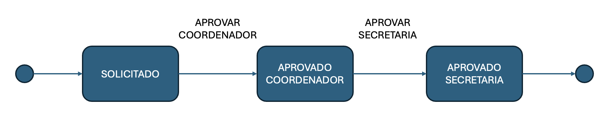

## Instalação

- [Spring Boot para VS Code](https://code.visualstudio.com/docs/java/java-spring-boot)

## Injeção de Dependência

- Calculadora **monolítico**
```java
package microservicos;

public class CalculadoraMonolitica {

    public void calcular(String[] args) {
        String operacao = args[0];
        Integer n1 = Integer.parseInt(args[1]);
        Integer n2 = Integer.parseInt(args[2]);

        System.out.println("\n\n------------ CALCULADORA MONOLITICA ------------");
        System.out.print("Resultado: ");

        if (operacao.equals("soma")) {
            System.out.println(n1 + n2);
        } else if (operacao.equals("subtracao")) {
            System.out.println(n1 - n2);
        } else if (operacao.equals("divisao")) {
            System.out.println(n1 / n2);
        } else if (operacao.equals("multiplicacao")) {
            System.out.println(n1 * n2);
        } else {
            System.out.println("Operacao invalida: " + operacao);
        }

        System.out.println();

    }

    public static void main(String[] args) {

        // Calculadora instanciada pelo usuário, dono do fluxo principal
        CalculadoraMonolitica c = new CalculadoraMonolitica();
        c.calcular(args);

    }
}
```
- Calculadora com **Spring**
- Incluir as dependências do projeto (`pom.xml`) - opcional se estiver utilizando *Spring Boot*
```xml
<dependency>
    <groupId>org.springframework</groupId>
    <artifactId>spring-beans</artifactId>
    <version>4.3.3.RELEASE</version>
</dependency>
<dependency>
    <groupId>org.springframework</groupId>
    <artifactId>spring-context</artifactId>
    <version>4.3.3.RELEASE</version>
</dependency>
<dependency>
    <groupId>org.springframework</groupId>
    <artifactId>spring-core</artifactId>
    <version>4.3.3.RELEASE</version>
</dependency>
```
- Criar uma interface `Operacao`
```java
package microservicos;

import org.springframework.stereotype.Service;

@Service
public interface Operacao {
    float executar(Integer v1, Integer v2);
}
```
- Criar uma classe `Somar`
```java
package microservicos;

import org.springframework.stereotype.Service;

@Service
public class Somar implements Operacao {

    @Override
    public float executar(Integer v1, Integer v2) {
        return v1 + v2;
    }

}
```
- Criar uma classe `Multiplicar`
```java
package microservicos;

import org.springframework.stereotype.Service;

@Service
public class Multiplicar implements Operacao {

    @Override
    public float executar(Integer v1, Integer v2) {
        return v1 * v2;
    }

}
```
- Criar um arquivo `beans.xml` (dentro da pasta `/src/main/java`)

```xml
<?xml version="1.0" encoding="UTF-8"?>

    <beans xmlns="http://www.springframework.org/schema/beans"
    xmlns:p="http://www.springframework.org/schema/p"
    xmlns:xsi="http://www.w3.org/2001/XMLSchema-instance"
    xsi:schemaLocation=
    "http://www.springframework.org/schema/beans
    http://www.springframework.org/schema/beans/spring-beans-3.2.xsd
    http://www.springframework.org/schema/context
    http://www.springframework.org/schema/context/spring-context-3.2.xsd"
    xmlns:context="http://www.springframework.org/schema/context">


<context:annotation-config />
<context:component-scan base-package="microservicos" />
<bean id="calculadora" class="microservicos.CalculadoraSpring">
 <property name="operacao" ref="multiplicar" />
</bean>
</beans>
```

- Class principal
```java
package microservicos;

import org.springframework.context.ApplicationContext;
import org.springframework.context.support.ClassPathXmlApplicationContext;

public class CalculadoraSpring {

    // operação é definida no beans.xml
    private Operacao operacao;

    public void calcular(String[] args) {
        Integer n1 = Integer.parseInt(args[0]);
        Integer n2 = Integer.parseInt(args[1]);

        System.out.println("\n------------ CALCULADORA SPRING ------------");
        System.out.print("Resultado: ");
        // qual operação será executada? Depende do que foi definido no beans.xml
        System.out.println(operacao.executar(n1, n2));
        System.out.println();

    }

    public void setOperacao(Operacao operacao) {
        this.operacao = operacao;
    }

    @SuppressWarnings("resource")
    public static void main(String[] args) {

        // cria o contexto e carrega os beans definidos no beans.xml
        // ou anotados com @Service (vide Multiplicar e Somar)
        ApplicationContext ctx = new ClassPathXmlApplicationContext("beans.xml");

        System.out.println("\nBeans reconhecidos dentro do contexto:\n");

        for (String beanName : ctx.getBeanDefinitionNames()) {
            // Evita que o nome dos beans do proprio spring sejam exibidos
            if (!beanName.contains("org.springframework")) {
                System.out.println(" - " + beanName);
            }
        }

        CalculadoraSpring c = ctx.getBean("calculadora", CalculadoraSpring.class);
        c.calcular(args);

    }
}
```
## Criando um End-Point
- Adicionar as dependências abaixo no `pom.xml`
    ```xml
    <dependency>
        <groupId>org.springframework.boot</groupId>
        <artifactId>spring-boot-starter-web</artifactId>
    </dependency>
    
    <dependency>
        <groupId>org.springframework.boot</groupId>
        <artifactId>spring-boot-devtools</artifactId>
        <scope>runtime</scope>
        <optional>true</optional>
    </dependency>
    ```
- Criar um *endpoint* para uma requisição *GET*
    ```java
    import org.springframework.web.bind.annotation.RestController;
    import org.slf4j.Logger;
    import org.slf4j.LoggerFactory;
    import org.springframework.web.bind.annotation.GetMapping;
    import org.springframework.web.bind.annotation.RequestMapping;
    
    @RestController
    @RequestMapping("/aluno")
    public class Aluno {
        private static final Logger logger = LoggerFactory.getLogger(Aluno.class);
    
        @GetMapping("/obter")
        public String getAluno() {
            logger.debug("Retornando aluno Joao...");
            return "Joao";
        }
    
    }
    ```
- Utilizando `ResponseEntity`
    ```java
    @GetMapping("/obter")
    public ResponseEntity<String> getAluno() {
      return new ResponseEntity<String>("Joao", HttpStatus.OK);
    }
    ```
- [Códigos Status HTTP](https://developer.mozilla.org/en-US/docs/Web/HTTP/Status)

## Trabalhando com Propriedades
- Editar o arquivo `application.properties`
- Por exemplo, definir o nível de *log*

    ```properties
    logging.level.org.springframework.web: DEBUG
    logging.level.nome.pacote: DEBUG
    ```
- Pode-se criar qualquer tipo de propriedade
- Para ler uma propriedade basta utilizar a injeção de dependência com `@Value`
    ```java
    @Value("${mensagem}")
    private String mensagem;
    ```
- Lê o valor da propriedade `mensagem` definida no arquivo `application.properties`
## Obtendo Parâmetros

- Na própria URL

    ```java
    @GetMapping("/obter/{id}")
    public String getAlunoPorNome(@PathVariable String id) {
      logger.debug("Retornando aluno com id = " + id);
      return "Encontrado aluno: " + id;
    }
    ```
- Via parâmetros

    ```java
    @GetMapping("/obter")
    public String getAlunoPorNome(@RequestParam(name="id", required = false, defaultValue = "0") String id) {
      logger.debug("Retornando aluno com id = " + id);
      return "Encontrado aluno: " + id;
    }
    ```

## Retornando JSON

- Criar uma classe para encapsular os atributos
    ```java
    public class AlunoBean {
    
    private String id;
    private String nome;
    
    @JsonIgnore
    private String senha;

    public AlunoBean(String id, String nome) {
      super();
      this.id = id;
      this.nome = nome;
    }
    // criar os gets / sets
    
    }
    ```
- Para retornar *XML*
    ```xml
    <dependency>
    <groupId>com.fasterxml.jackson.dataformat</groupId>
    <artifactId>jackson-dataformat-xml</artifactId>
    </dependency>
    ```
- Alterar o parâmetro do *header* da requisição `Accept: application/xml`
## Processando POST
- Instalar o [Postman](https://www.postman.com/downloads/)
- Processando requisições do tipo *POST*
    ```java
    @PostMapping("/cadastrar")
    public ResponseEntity<Integer> cadastrar(@RequestBody AlunoBean aluno) {
        logger.debug("Cadastrando aluno: " + aluno.getNome());
        return new ResponseEntity<Integer>(Integer.parseInt("1"), HttpStatus.OK);
    }
    ```
## Tratamento de Erros
- Criar uma classe para encapsular o tipo de exceção
    ```java
    public class AlunoNaoLocalizadoException extends RuntimeException {
    }
    ```
- Definir uma classe para lidar com as exceções
    ```java
    @RestControllerAdvice
    public class GlobalExceptionHandler {
        @ResponseStatus(
                value = HttpStatus.NOT_FOUND,
                reason = "Aluno não localizado!")
        @ExceptionHandler(AlunoNaoLocalizadoException.class)
        public void handleException(AlunoNaoLocalizadoException e) {
    
        }
    
    }
    ```
- Lançar a exceção, quando aplicado
    ```java
    throw new AlunoNaoLocalizadoException();
    ```
***
## Validação de Dados
- Utilizar o `spring-boot-starter-validation`
    ```xml
    <dependency>
    <groupId>org.springframework.boot</groupId>
    <artifactId>spring-boot-starter-validation</artifactId>
    </dependency>
    ```
- [Referência](https://docs.oracle.com/javaee/7/api/javax/validation/constraints/package-summary.html)
- Exemplo
    ```java
    @PostMapping
    public ResponseEntity<AlunoBean> criar(@Valid @RequestBody AlunoBean aluno) {
    return new ResponseEntity<AlunoBean>(aluno, HttpStatus.OK);
    }
    ```
- Na classe `AlunoBean` definir as restrições
    ```java
    @Size(min = 10, message="Nome deve conter no minimo 10 caracteres")
    private String nome;
    ```
- Definir o tratamento de erro no *Controller Advice* (`GlobalExceptionHandler`) caso o tratamento seja global
    ```java
    @ResponseStatus(HttpStatus.BAD_REQUEST)
    @ExceptionHandler(MethodArgumentNotValidException.class)
    public Map<String, String> handleMethodArgumentNotValid(MethodArgumentNotValidException ex) {
        Map<String, String> errors = new HashMap<String, String>();
        ex.getBindingResult().getFieldErrors().forEach(error ->
        errors.put(error.getField(), error.getDefaultMessage()));
        return errors;
    }
    ```
***
## Persistência
- Utilizar o `spring-boot-starter-data-jpa`
    ```xml
    <dependency>
     <groupId>org.springframework.boot</groupId>
     <artifactId>spring-boot-starter-data-jpa</artifactId>
    </dependency>
    
    <dependency>
     <groupId>com.h2database</groupId>
     <artifactId>h2</artifactId>
     <scope>runtime</scope>
    </dependency>
    ```
- [Console H2](http://localhost:8080/h2-console)
- Configurar o **H2**
    ```javascript
    spring.datasource.url=jdbc:h2:mem:testdb
    spring.datasource.driverClassName=org.h2.Driver
    spring.datasource.username=sa
    spring.datasource.password=password
    spring.jpa.database-platform=org.hibernate.dialect.H2Dialect
    spring.h2.console.enabled=true
    spring.jpa.defer-datasource-initialization=true
    ```
- Criar um arquivo `data.sql` dentro da pasta `resources`
    ```sql
    DROP TABLE IF EXISTS tab_aluno;
    
    CREATE TABLE tab_aluno (
        id_aluno INT AUTO_INCREMENT PRIMARY KEY,
        nome VARCHAR(30) NOT NULL,
        turma VARCHAR(10) NOT NULL,
        curso VARCHAR(50) DEFAULT NULL
    );
    ```
- Definir o *Bean* para a persistência
    ```java
    @Entity
    @Table(name="TAB_ALUNO")
    public class AlunoEntity {
    @Id
    @Column(name = "ID_ALUNO")
    @GeneratedValue(strategy=GenerationType.AUTO)
    private int id;
    private String nome;
    private String turma;
    private String curso; 
    // getters e setters
    ```
- Criar o repositório
    ```java
    @Repository
    public interface AlunoRepository extends CrudRepository<AlunoEntity, Integer>{
    }
    ```
- Métodos disponíveis de `CrudRepository`
    - `save(entidade)` – persiste uma entidade (insert / update)
    - `deleteById(id)` – remove um registro por meio do id
    - `deleteAll()` – remove todos os registros
    - `findAll()` – retorna todos os registros
    - `findById(id)` – localiza um registro por meio do id
    - `count()` – retorna o número total de registros
    - `existis(id)` – verifica se um registro existe com base em seu id
- Utilizando no *controller*
    ```java
    @RestController
    @RequestMapping(value = "aluno")
    public class AlunoService {
    
    @Autowired
    private AlunoRepository alunoRepo = null;
    
    @PostMapping(value="/cadastrar")
    public AlunoEntity cadastrar(@RequestBody AlunoEntity aluno) {
      return alunoRepo.save(aluno);
    }
    
    }
    ```
- Retornando uma lista
    ```java
    @GetMapping(value="/obter")
    public List<AlunoEntity> getAluno() {
    List<AlunoEntity> ret = new ArrayList<AlunoEntity>();
     for (AlunoEntity aluno:alunoRepo.findAll()) {
      ret.add(aluno);
     }
      return ret;
    
    }
    ```
- Outra opção
    ```java
    @GetMapping("/obter")
    public ResponseEntity<Iterable<AlunoBean>> obterTodos() {
    return new ResponseEntity<Iterable<AlunoBean>>(dao.findAll(), HttpStatus.OK);
    }
    ```
***
### Consultas Derivadas
- [Referência](https://docs.spring.io/spring-data/jpa/docs/current/reference/html/#jpa.query-methods)
- É possível criar consultas simples porém de forma muito eficiente utilizando-se consultas derivadas, isto é, que seguem um determinado padrão de nomenclatura envolvendo nomes de atributos da entidade
- Basta declarar a assinatura do método desejado na interface `@Repository`
- Por exemplo, `findByNome (String nome)` efetua uma busca utilizando como chave o atributo nome
- Outros exemplos:
    - `findByNomeIsNot(String nome)` – nomes diferentes de...
    - `findByTurmaIsNull()` – alunos onde o atributo turma seja nulo
    - `findByNomeContaining(String prefixo)` – alunos cujo nome contenha o prefixo informado
    - `findByNomeLike(String expressao)` – efetua um like no nome, por exemplo, %Joao%
### Consultas Personalizadas
- Além das consultas derivadas também é possível criar consultas personalizadas informando o código SQL diretamente
    ```java
    @Query("select a from GASTO_BEAN a where a.username = ?1")
    List<AlunoEntity> alunosPorTurma(String username);
    ```
- Exemplos:
    ```java
    @Repository
    public interface AlunoDAO extends CrudRepository<AlunoBean, Integer> {
    
        // sempre inicia com findBy...
        // incluir nome do atributo
        Iterable<AlunoBean> findByCurso(String curso);
    
        // SELECT * FROM TAB_CURSO WHERE CURSO = ? AND TURMA = ?
        Iterable<AlunoBean> findByCursoAndTurma(String curso, String turma);
    
        // SELECT * FROM TAB_ALUNO WHERE NOME LIKE ?
        Iterable<AlunoBean> findByNomeLike(String nome);
    
        @Query("select a.id from TAB_ALUNO a")
        Iterable<Integer> minhaConsulta();
    
    }
    ```
***
### Data Rest
- Permite criar endpoints diretamente do repositório sem a necessidade de um *controller*
    ```xml
    <dependency>
    <groupId>org.springframework.boot</groupId>
    <artifactId>spring-boot-starter-data-rest</artifactId>
    </dependency>
    ```
- Criar apenas a interface anotada como `@Repository` e estendendo `CrudRepository`
- Adicionar uma configuração `spring.data.rest.basePath=/api`
- Para testar: `http://localhost:8080/api`
- [Referência](https://docs.spring.io/spring-data/rest/docs/current-SNAPSHOT/reference/html/#reference)
- Utilizar a anotação `@RestResource` para bloquear determinados métodos
- `@RepositoryRestResource` pode ser utilizado para definir o caminho para acessar o *endpoint*
    ```java
    @RepositoryRestResource(path = "aluno", collectionResourceRel = "lista")
    public interface AlunoRestResource extends JpaRepository<AlunoEntity, String> {
    
            @Override
            @RestResource(exported = false)
            void deleteById(String id);
    }        
    ```
- Para incluir o atribudo `id` nas respostas das APIs mapeadas pelo *Data Rest*
    ```java
    @Component
    public class DataRestConfig implements RepositoryRestConfigurer {
    
        @Override
        public void configureRepositoryRestConfiguration(RepositoryRestConfiguration config, CorsRegistry cors) {
            // Incluir as classes Bean que terão seus ids expostos
            config.exposeIdsFor(MatriculaBean.class, DisciplinaBean.class);
        }
    
    }
    ```
- Para maiores configurações [Vide](https://docs.spring.io/spring-data/rest/docs/current/api/org/springframework/data/rest/core/config/RepositoryRestConfiguration.html)
***
## Aplicação Console
- Para executar uma aplicação Spring Boot no console
    ```java
    @Component
    public class ConsoleSpring implements CommandLineRunner {
    
        @Override
        public void run(String... args) throws Exception {
    
        }
    
    }
    ```
***
## Efetuando Requisições HTTP
- Alterar a dependência no `pom.xml` para não incluir o *tomcat* como servidor:
    ```xml
    <dependency>
        <groupId>org.springframework.boot</groupId>
        <artifactId>spring-boot-starter-web</artifactId>
        <exclusions>
            <exclusion>
                <groupId>org.springframework.boot</groupId>
                <artifactId>spring-boot-starter-tomcat</artifactId>
            </exclusion>
        </exclusions>
    </dependency>
    ```
- Utilizar o `RestClient`
    ```java
    RestClient restClient = RestClient.create();

    ResponseEntity<String> result = restClient.get()
            .uri("http://localhost:8080/aluno/1")
            .retrieve()
            .toEntity(String.class);
    System.out.println("Status: " + result.getStatusCode());
    System.out.println("Headers: " + result.getHeaders());
    System.out.println("Conteudo: " + result.getBody());
    ```
- Encapsular o resultado em um objeto da classe `AlunoBean`:
    ```java
    RestClient restClient = RestClient.create();
    
    ResponseEntity<AlunoBean> result = restClient.get()
            .uri("http://localhost:8080/aluno/101")
            .retrieve()
            .toEntity(AlunoBean.class);
    System.out.println("Status: " + result.getStatusCode());
    System.out.println("Headers: " + result.getHeaders());
    System.out.println("Conteudo: " + result.getBody().getNome());
    ```
- Efetuando um *POST* (sem retorno esperado no corpo da resposta)
    ```java
    AlunoBean aluno = new AlunoBean();
    ResponseEntity<Void> response = restClient.post()
      .uri("ttp://localhost:8080/aluno")
      .contentType(APPLICATION_JSON)
      .body(aluno)
      .retrieve()
      .toBodilessEntity();
    ```
## Trabalhando com JSON
- Incluir nas dependências do projeto `pom.xml`
    ```xml
    <dependency>
        <groupId>org.json</groupId>
        <artifactId>json</artifactId>
        <version>20240303</version>
    </dependency>
    ```
- Principais classes e métodos:
    - `JSONObject`: representa um objeto JSON
    - `JSONArray`: representa um array JSON
    - `length()`: retorna o total de objetos contidos no `JSONArray`
    - `getJSONObject()`, `getJSONArray()`, `getString()`, etc...: retornam o valor de um atributo de um objeto JSON
### Mapeando Atributos JSON para Objetos
- Utilizar o `ObjectMapper`:
    ```java
    ObjectMapper objectMapper = new ObjectMapper().configure(DeserializationFeature.FAIL_ON_UNKNOWN_PROPERTIES, false);
    ```
- Exemplo:
    ```java
    DisciplinaBean disciplina = objectMapper.readValue(disciplinas.getJSONObject(i).toString(), DisciplinaBean.class);
    ```
### Utilizando o Open Feign
- Uma alternativa para realizar requisições HTTP
    ```xml
    <dependency>
    <groupId>org.springframework.cloud</groupId>
    <artifactId>spring-cloud-starter-openfeign</artifactId>
    <version>4.2.0</version>
    </dependency>
    ```
- Habilitar o uso do OpenFeign (`@EnableFeignClients`) na classe `Application`
    ```java
    @SpringBootApplication
    @EnableFeignClients
    public class AlunoApplication {
    
    	public static void main(String[] args) {
    		SpringApplication.run(AlunoApplication.class, args);
    	}
    
    }
    ```
- Implementar as requisições
    ```java
    @FeignClient(name = "aluno", url = "localhost:8080")
    public interface AlunoClienteFeign {
    
        @GetMapping("/aluno/{ra}")
        public ResponseEntity<AlunoEntity> obterAluno(@PathVariable String ra);
    
    }
    ```
- Testar o acesso
    ```java
    @Autowired
    private AlunoClienteFeign alunoFeign;
    
    @Override
    public void run(String... args) throws Exception {
    
        System.out.println("----------------");
        System.out.println(alunoFeign.obterAluno("400").getBody().getNome());
    
    }
    ```
***
### Spring State Machine
- Aluno pode solicitar o cancelamento de uma matrícula em determinada disciplina
- Para isso, existe um *worflow* conforme abaixo
    
- Importar as dependências
    ```xml
    <dependency>
        <groupId>org.springframework.statemachine</groupId>
        <artifactId>spring-statemachine-starter</artifactId>
        <version>3.2.1</version>
    </dependency>
    ```
- Criar os estados e eventos
    ```java
    public enum CancelamentoMatriculaEstado {
        SOLICITADO, APROVADO_COORDENADOR, APROVADO_SECRETARIA
    }
    ```
    ```java
    public enum CancelamentoMatriculaEvento {
        APROVAR_COORDENADOR, APROVAR_SECRETARIA
    }
    ```
- A configuração da máquina de estados deve ser feita em uma classe anotada com `@Configuration` e `@EnableStateMachine`
    ```java
    @Configuration
    @EnableStateMachineFactory
    public class CancelamentoWorkflowConfig extends StateMachineConfigurerAdapter<CancelamentoMatriculaEstado, CancelamentoMatriculaEvento> {

        private static final Logger logger = LoggerFactory.getLogger(CancelamentoWorkflowConfig.class);
        
    }
    ```
- Configurar os estados
    ```java
    @Override
    public void configure(StateMachineStateConfigurer<CancelamentoMatriculaEstado, CancelamentoMatriculaEvento> states)
            throws Exception {

        states.withStates()
                .initial(CancelamentoMatriculaEstado.SOLICITADO, initialAction())
                .end(CancelamentoMatriculaEstado.APROVADO_SECRETARIA)
                .state(CancelamentoMatriculaEstado.APROVADO_COORDENADOR);

    }

    @Bean
    public Action<CancelamentoMatriculaEstado, CancelamentoMatriculaEvento> initialAction() {
        return new Action<CancelamentoMatriculaEstado, CancelamentoMatriculaEvento>() {

            @Override
            public void execute(StateContext<CancelamentoMatriculaEstado, CancelamentoMatriculaEvento> context) {
                logger.info("Iniciado o WF Cancelamento de Matricula");
            }
        };
    }
    ```
- Configurar as transições entre os estados
    ```java    
    @Override
    public void configure(
            StateMachineTransitionConfigurer<CancelamentoMatriculaEstado, CancelamentoMatriculaEvento> transitions)
            throws Exception {

        transitions.withExternal()
                .source(CancelamentoMatriculaEstado.SOLICITADO).target(CancelamentoMatriculaEstado.APROVADO_COORDENADOR)
                .event(CancelamentoMatriculaEvento.APROVAR_COORDENADOR)
                .and()
                .withExternal()
                .source(CancelamentoMatriculaEstado.APROVADO_COORDENADOR)
                .target(CancelamentoMatriculaEstado.APROVADO_SECRETARIA)
                .event(CancelamentoMatriculaEvento.APROVAR_SECRETARIA);

    }
    ```
- Definir as configurações gerais e o *listener* que será acionado quando houver uma transição entre os estados
    ```java    
    @Override
    public void configure(
            StateMachineConfigurationConfigurer<CancelamentoMatriculaEstado, CancelamentoMatriculaEvento> config)
            throws Exception {

        config.withConfiguration().autoStartup(true).listener(listener()).machineId("cancelamento-matricula");
    }

    @Bean
    public StateMachineListener<CancelamentoMatriculaEstado, CancelamentoMatriculaEvento> listener() {
        return new StateMachineListenerAdapter<CancelamentoMatriculaEstado, CancelamentoMatriculaEvento>() {
            @Override
            public void stateChanged(State<CancelamentoMatriculaEstado, CancelamentoMatriculaEvento> from,
                    State<CancelamentoMatriculaEstado, CancelamentoMatriculaEvento> to) {

                logger.info("Estado alterado para: " + to.getId());
            }
        };
    }
    ```
- Efetuar as transições de eventos entre os estados
    ```java
    @Service
    public class FaculdadeServico {
    
        private static final Logger logger = LoggerFactory.getLogger(FaculdadeServico.class);
    
        @Autowired
        private StateMachineFactory<CancelamentoMatriculaEstado, CancelamentoMatriculaEvento> cancelamentoFactory;
    
        private StateMachine<CancelamentoMatriculaEstado, CancelamentoMatriculaEvento> cancelamento;
    
        public CancelamentoMatriculaEstado solicitar() {
            this.cancelamento = cancelamentoFactory.getStateMachine();
            cancelamento.startReactively().block();
            logger.info("Solicitado Cancelamento::UUID = " + cancelamento.getUuid().toString());
            logger.info("Estado = " + cancelamento.getState().getId() + " - finalizado = " + cancelamento.isComplete());
            return cancelamento.getState().getId();
        }
    
        public CancelamentoMatriculaEstado aprovarCoordenador() {
    
            cancelamento
                    .sendEvent(
                            Mono.just(MessageBuilder.withPayload(CancelamentoMatriculaEvento.APROVAR_COORDENADOR).build()))
                    .blockFirst();
            logger.info("Estado = " + cancelamento.getState().getId() + " - finalizado = " + cancelamento.isComplete());
            return cancelamento.getState().getId();
    
        }
    
        public CancelamentoMatriculaEstado aprovarSecretaria() {
    
            cancelamento
                    .sendEvent(
                            Mono.just(MessageBuilder.withPayload(CancelamentoMatriculaEvento.APROVAR_SECRETARIA).build()))
                    .blockFirst();
            cancelamento.stopReactively().block();
            logger.info("Estado = " + cancelamento.getState().getId() + " - finalizado = " + cancelamento.isComplete());
            return cancelamento.getState().getId();
    
        }
    
    }
    ```
- Finalmente, criar os *endpoints* para executar os eventos
    ```java
     @PutMapping("/matricula/cancelar/solicitar/{rm}/{idDisciplina}")
    public ResponseEntity<CancelamentoMatriculaEstado> solicitarCancelamento(@PathVariable String rm,
            @PathVariable String idDisciplina) {

        return new ResponseEntity<CancelamentoMatriculaEstado>(faculdade.solicitar(), HttpStatus.OK);

    }

    @PutMapping("/matricula/cancelar/aprovar/coordenador/{rm}/{idDisciplina}")
    public ResponseEntity<CancelamentoMatriculaEstado> aprovarCoordenador(@PathVariable String rm,
            @PathVariable String idDisciplina) {
        return new ResponseEntity<CancelamentoMatriculaEstado>(faculdade.aprovarCoordenador(), HttpStatus.OK);

    }

    @PutMapping("/matricula/cancelar/aprovar/secretaria/{rm}/{idDisciplina}")
    public ResponseEntity<CancelamentoMatriculaEstado> aprovarSecretaria(@PathVariable String rm,
            @PathVariable String idDisciplina) {
        faculdade.aprovarSecretaria();
        return new ResponseEntity<CancelamentoMatriculaEstado>(faculdade.aprovarSecretaria(), HttpStatus.OK);

    }
    ```
- Ações podem ser executadas entre os estados associando uma `action` dentro da classe de configuração (Ex: `CancelamentoWorkflowConfig`)
- No exemplo baxo são exibidas as variáveis que podem ser associadas na execução da ação
    ```java
    public void configure(
        StateMachineTransitionConfigurer<CancelamentoMatriculaEstado, CancelamentoMatriculaEvento> transitions)
        throws Exception {

    transitions.withExternal()
            .source(CancelamentoMatriculaEstado.SOLICITADO).target(CancelamentoMatriculaEstado.APROVADO_COORDENADOR)
            .event(CancelamentoMatriculaEvento.APROVAR_COORDENADOR)
            .and()
            .withExternal()
            .source(CancelamentoMatriculaEstado.APROVADO_COORDENADOR)
            .target(CancelamentoMatriculaEstado.APROVADO_SECRETARIA)
            .event(CancelamentoMatriculaEvento.APROVAR_SECRETARIA)
            .action(ctx -> {
                logger.info("Parametros: " + ctx.getStateMachine().getExtendedState().getVariables());
            });

    }
    ```
- Para associar variáveis, alterar a classe de serviços e incluir a variável por meio do `getExtendedState()`
    ```java
    public CancelamentoMatriculaEstado aprovarSecretaria() {

    cancelamento.getExtendedState().getVariables().put("ID_ALUNO", "X");
    
    cancelamento
            .sendEvent(
                    Mono.just(MessageBuilder.withPayload(CancelamentoMatriculaEvento.APROVAR_SECRETARIA).build()))
            .blockFirst();
    cancelamento.stopReactively().block();
    logger.info("Estado = " + cancelamento.getState().getId() + " - finalizado = " + cancelamento.isComplete());
    return cancelamento.getState().getId();

    }
    ```
# Exercício
- Implementar um serviço CRUD para disciplina com os seguintes requisitos (utilizar *Data Rest*):
    - Disciplina possui um id numérico sequencial, um nome e carga horária;
    - Criar um endpoint com método POST para criar uma nova disciplina (POST `http://localhost:8080/api/disciplina`);
    - Criar um endpoint GET para retornar os dados de uma disciplina por id (GET `http://localhost:8080/api/disciplina/{id}`)
    - Criar um endpoint GET para retornar uma lista contendo todas as disciplinas (GET `http://localhost:8080/api/disciplina`);
    - Criar um endpoint com um método PUT que permita alterar o nome e a carga horária de uma disciplina (PUT `http://localhost:8080/api/disciplina`);
    - Criar um endpoint com um método DELETE que permita excluir uma disciplina (DELETE `http://localhost:8080/api/disciplina/{id}`);
- Criar um serviço para controle de matrícula:
    - Matrícula possui id do aluno, id da disciplina e um status (ATIVO, CANCELADO)
    - Definir um endpoint para associar o id de um aluno ao id de uma disciplina (POST `http://localhost:8080/matricula/{idAluno}/{idDisciplina}`);
    - Definir um endpoint para cancelar a matrícula do aluno de uma disciplina alterando o status (DELETE `http://localhost:8080/matricula/{idAluno}/{idDisciplina}`);
- Criar um serviço orquestrador chamado faculdade para:
    - Retornar todas as disciplinas ativas de um determinado aluno (GET `http://localhost:8080/faculdade/disciplinas/{idAluno}`);
    - Retornar a carga horária total de um aluno (GET `http://localhost:8080/faculdade/carga/{idAluno}`);
    - Remover uma disciplina (somente permitir excluir uma disciplina que não possua alunos associados) (DELETE `http://localhost:8080/faculdade/disciplinas/{idDisciplina}`);

## Documentação Endpoints
- Padrão [OpenAPI](https://spec.openapis.org/oas/latest.html)
- Exemplo [Strava API](https://developers.strava.com/swagger/swagger.json)
- Utilizar o [Swagger](https://swagger.io/) para visualizar a documentação no padrão *OpenAPI*
- Adicionar a dependência:
    ```xml
    <dependency>
        <groupId>org.springdoc</groupId>
        <artifactId>springdoc-openapi-starter-webmvc-ui</artifactId>
        <version>2.2.0</version>
    </dependency>
    ```
- Visualizando os *endpoints*:
    - Formato JSON: http://localhost:8080/v3/api-docs
    - Formato YAML: http://localhost:8080/v3/api-docs.yaml
    - Interface HTML (Swagger): http://localhost:8080/swagger-ui/index.html
- Anotações para documentação:
    - End points:
    ```java
    @OpenAPIDefinition(info=@Info(title="Controle de Alunos"))
    ```
    - Operações: 
    ```java
    @Operation(summary = "Lista alunos", description = "Obtem a lista de todos os alunos", tags = { "alunos" })
    @Parameters(value={@Parameter(name = "id")})
    ```
    - Respostas:
    ```java
    @ApiResponses(value = {
    @ApiResponse(responseCode = "200", description = "Encontrou o aluno", content = { @Content(mediaType = "application/json",
    schema = @Schema(implementation = AlunoBean.class)) }), @ApiResponse(responseCode = "400", description = "Id do aluno inválido",
    content = @Content),
    @ApiResponse(responseCode = "404", description = "Aluno não localizado",
    content = @Content) })
    ```
- Documentando as entidades
    ```java
    @Schema(name="Aluno", description = "Representa um aluno")
    public class AlunoBeanV1 {
    @Schema(name = "matricula", description = "Número de matrícula", required = true, example = "M12345")
    private String matricula;
    }
    ```
## Geração Clientes
- Em nodejs utilizar o pacote[openapi-client-axios](https://www.npmjs.com/package/openapi-client-axios)
- Criar um projeto *nodejs*
```bash
mkdir cliente-node
cd cliente-node
npm init -y
```
- Importar o `openape-client-axios`
```bash
npm i --save openapi-client-axios
```
- Gerar o cliente
```bash
npx openapicmd typegen http://localhost:8080/v3/api-docs > openapi.d.ts
```
- Efetuar as chamadas aos *endpoints*
    ```javascript
    const OpenAPIClientAxios = require("openapi-client-axios").default;
    
    const api = new OpenAPIClientAxios({
        definition: "http://localhost:8080/v3/api-docs",
    });
    api.init()
        .then((client) =>
            client.getAluno(101)
        )
        .then((res) => console.log("Resultado:", res.data));
    ```
## Actuator
- Permite verificar a "saúde" (health) de um serviço, por exemplo, se ele está em execução, sua disponibilidade, configuração, etc...
- Incluir a seguinte dependência ao projeto:
    ```xml
    <dependency>
    <groupId>org.springframework.boot</groupId>
    <artifactId>spring-boot-starter-actuator</artifactId>
    </dependency>
    ```
- A porta do actuator pode ser alterada por meio da propriedade `management.server.port` (por exemplo, `8081`)
- Acessar a URL `http://localhost:8081/actuator` ou `http://localhost:8081/actuator/health`
- Para incluir maiores informações sobre as informações da disponibilidade dos serviços (*health*) basta ativar a configuração `management.endpoint.health.show-details=always`
### Health Check Personalizado
- Um health check personalizado permite especificar quando um determinado serviço está acessível
    ```java
    @Component
    public class AlunoMonitor implements HealthIndicator {
    
        @Override
        public Health health() {
            return Health.down().build();
        }
    
    }
    ```
- Por exemplo, pode-se verificar se o banco de dados está disponível
    ```java
    @Component("dbFaculdade")
    public class DatabaseHealthContributor
            implements HealthIndicator {
    
        @Autowired
        private DataSource ds;
    
        @Override
        public Health health() {
            try (Connection conn = ds.getConnection()) {
                Statement stmt = conn.createStatement();
                stmt.execute("select COUNT(*) from TAB_ALUNO");
            } catch (SQLException ex) {
                return Health.outOfService().withException(ex).build();
            }
            return Health.up().build();
        }
    }
    ```
### Configurando o Prometheus
- Incluir a dependência
    ```xml
    <dependency>
    <groupId>io.micrometer</groupId>
    <artifactId>micrometer-registry-prometheus</artifactId>
    </dependency>
    ```
- Habilitar o *endpoint* do *Prometheus* com a propriedade `management.endpoints.web.exposure.include=health,info,prometheus`
- Acessar o *endpoint* `http://localhost:8081/actuator/prometheus`
- Criar um arquivo *yaml* para configurar o *Prometheus* com o nome `prometheus-config.yml`
    ```yaml
    global:
      scrape_interval:     15s
      evaluation_interval: 15s
    scrape_configs:
      - job_name: 'faculdade'
        metrics_path: '/actuator/prometheus'
        scrape_interval: 5s
        static_configs:
        - targets: ["substituir_hostname:8081"]
    ```
- Obter a imagem e iniciar um container do *Prometheus*
    ```shell
    docker login docker.io
    docker run -p 9095:9090 -v ./prometheus-config.yml:/etc/prometheus/prometheus.yml --name prometheus prom/prometheus
    ```
- Acessar na URL `http://localhost:9090/targets`
### Métricas
- Para habilitar mais *endpoints* alterar `management.endpoints.web.exposure.include=*`
- Exemplo de uma métrica persinalizada:
    ```java
    @Component
    public class MetricaAluno {
        MetricaAluno(MeterRegistry registry) {
            registry.counter("total.alunos", Tags.of("teste", "10"));
        }
    }
    ```
### Informações
- Algumas configurações podem ser habilitadas:
    ```java
    management.info.java.enabled=true
    info.app.name=@project.name@
    info.app.description=@project.description@
    info.app.version=@project.version@
    info.app.encoding=@project.build.sourceEncoding@
    info.app.java.version=@java.version@
    ```
### Outros End Points
- Por meio do actuator é também possível terminar um serviço (propriedade `management.endpoint.shutdown.enabled=true`)
### Spring Admin Server
- É uma interface web para administração das aplicações *Spring Boot*
- Criar um novo projeto *Sprint Boot* e adicionar as dependências:
    ```xml
    <dependency>
        <groupId>org.springframework.boot</groupId>
        <artifactId>spring-boot-starter</artifactId>
    </dependency>
    
    <dependency>
        <groupId>org.springframework.boot</groupId>
        <artifactId>spring-boot-starter-web</artifactId>
    </dependency>
    
    <dependency>
        <groupId>de.codecentric</groupId>
        <artifactId>spring-boot-admin-starter-server</artifactId>
        <version>3.1.5</version>
    </dependency>
    ```
- Especificamente para o **MacOS**
    ```xml
    <dependency>
        <groupId>io.netty</groupId>
        <artifactId>netty-all</artifactId>
    </dependency>
    ```
- Especificar a porta na qual o *Admin Server* irá executar: `server.port=8082`
- Na classe principal do projeto adicionar as seguintes anotações:
    ```java
    @EnableAdminServer
    @SpringBootApplication
    public class AdminApplication {
    
    	public static void main(String[] args) {
    		SpringApplication.run(AdminApplication.class, args);
    	}
    
    }
    ```
- Acessar a interface administrativa: `http://localhost:8082`
- Registrar as aplicações que serão monitoradas, adicionando a dependência:
    ```xml
    <dependency>
        <groupId>de.codecentric</groupId>
        <artifactId>spring-boot-admin-starter-client</artifactId>
        <version>3.1.5</version>
    </dependency>
    ```
- Apontar para o *Admin Server* com as propriedades `spring.boot.admin.client.url=http://localhost:8082` e `management.endpoint.health.show-details=always`
## Segurança Básica
- Para garantir um nível de segurança mínimo para os *endpoints* é possível ativar um *starter*
    ```xml
    <dependency>
    <groupId>org.springframework.boot</groupId>
    <artifactId>spring-boot-starter-security</artifactId>
    </dependency>
    ```
- Observar após o início do serviço que é getada uma senha automaticamnte para acesso:

    `Using generated security password: 2cee0e0c-3e35-453d-ac8b-f3f040c849cf`

- Por padrão o usuário definido é *user*
- Ao tentar acessar qualquer *endpoint* sem fornecer as credenciais será gerado um erro HTTP 401 (Unauthorized)
- Para que seja autorizado o acesso deve-se definir no cabeçalho da requisição o tipo de Autorização *Basic*
- Caso seja necessário fornecer um usuário e senha padrão basta editar o `application.properties` e definir as seguintes propriedades:
    ```javascript
    spring.security.user.name = teste
    spring.security.user.password = 123
    ```
### RestClient
- Definir no Header da requisição:
    ```java
    String plainCreds = "teste:123";
    byte[] plainCredsBytes = plainCreds.getBytes();
    byte[] base64CredsBytes = Base64.getEncoder().encode(plainCredsBytes);
    String base64Creds = new String(base64CredsBytes);
    ResponseEntity<AlunoBean> response = restClient.get()
                    .uri("http://localhost:8080/aluno/{idAluno}", idAluno)
                    .header("Authorization", "Basic " + base64Creds)
                    .retrieve()
                    .toEntity(AlunoBean.class);
    ```
### Cross Site Request Forgery (CSRF)
- É uma proteção de segurança que impede que serviços hospedados em servidores distintos sejam acessados mutuamente
- Para desabilitar o *CSRF*:
    ```javascript
    @Configuration
    public class SecurityConfig extends WebSecurityConfigurerAdapter {
    
        @Override
        protected void configure(HttpSecurity http) throws Exception {
           super.configure(http);
           http.csrf().disable();
        }
    }
    ```
## Personalizando a Segurança
- Criar uma classe para sobrescrever a seguraça padrão:

    ```java
    @Configuration
    @EnableWebSecurity
    public class CustomSecurity {
        @Bean
        public SecurityFilterChain filterChain(HttpSecurity http) throws Exception {
    
            http.authorizeHttpRequests(authz -> authz
                    .requestMatchers("/seguranca/publico/**").permitAll()
                    .requestMatchers("/seguranca/admin/**").hasRole("ADMIN")
                    .anyRequest().authenticated())
                    .httpBasic(Customizer.withDefaults());
            return http.build();

        }
    
        @Bean
        public InMemoryUserDetailsManager userDetailsService(PasswordEncoder passwordEncoder) {
    
            UserDetails user = User.withUsername("user")
                    .password(passwordEncoder.encode("password"))
                    .roles("USER")
                    .build();
    
            UserDetails admin = User.withUsername("admin")
                    .password(passwordEncoder.encode("admin"))
                    .roles("USER", "ADMIN")
                    .build();
    
            return new InMemoryUserDetailsManager(user, admin);
        }
    
        @Bean
        public PasswordEncoder passwordEncoder() {
            PasswordEncoder encoder = PasswordEncoderFactories.createDelegatingPasswordEncoder();
            return encoder;
        }
    
    }
    ```
## Autenticação e Autorização com OAuth2
- Instalar o *Keycloack* como provedor de autenticação
- Utilizar o ambiente on-line para o docker [Play With Docker](https://labs.play-with-docker.com/)
- Executar um container com o *Keycloack*
    ```s
    docker run -p 9090:8080 -e KEYCLOAK_ADMIN=admin -e KEYCLOAK_ADMIN_PASSWORD=admin quay.io/keycloak/keycloak:24.0.2 start-dev
    ```
- Acessar o console do *Keycloack* e efetuar login como `admin`/`admin`
- Seguir o [Guia de Configuração do Keyglock](https://www.keycloak.org/getting-started/getting-started-docker)
- Desabilitar User verify profile (Authentication (menu lateral esquerdo) -> Required actios tab)
- Para obter o token, realizar um *POST* na URL `http://localhost:9090/realms/FaculdadeHealm/protocol/openid-connect/token`
    - No header da requisição deve constar `Content-Type`:`application/x-www-form-urlencoded`
    - Definir os parâmetros abaixo no corpo da requisição:
        - client_id:<your_client_id>
        - username:<your_username>
        - password:<your_password>
        - grant_type:password
- O token obtido pode ser decodificado em (Jwt)[https://jwt.io/]
- Para as requisições aos endpoints o token dever-a ser passado no header como 'Authorization': 'Bearer' + access_token
### Configuração no Spring
- Incluir a dependência abaixo:
```xml
<dependency>
    <groupId>org.springframework.boot</groupId>
    <artifactId>spring-boot-starter-oauth2-resource-server</artifactId>
</dependency>
```
- Requisitar o token
    ```java
    @RestController
    @RequestMapping("/login")
    public class Login {
    
        @GetMapping
        public ResponseEntity<String> login() {
    
            RestTemplate restTemplate = new RestTemplate();
    
            HttpHeaders headers = new HttpHeaders();
            headers.setContentType(MediaType.APPLICATION_FORM_URLENCODED);
    
            MultiValueMap<String, String> requestBody = new LinkedMultiValueMap<String, String>();
            requestBody.add("username", "admin");
            requestBody.add("password", "admin");
            requestBody.add("client_id", "faculdade");
            requestBody.add("grant_type", "password");
    
            ResponseEntity<String> response = restTemplate.postForEntity(
                    "http://localhost:9090/realms/FaculdadeHealm/protocol/openid-connect/token",
                    new HttpEntity<>(requestBody, headers), String.class);
    
            JSONObject json = new JSONObject(response.getBody());
            System.out.println(json);
            return response;
        }
    
    }
    ```
- Incluir essas propriedades
    ```properties
    # Security Configuration
    spring.security.oauth2.resourceserver.jwt.issuer-uri=http://localhost:9090/realms/FaculdadeHealm
    spring.security.oauth2.resourceserver.jwt.jwk-set-uri=${spring.security.oauth2.resourceserver.jwt.issuer-uri}/protocol/openid-connect/certs
    
    # JWT Configuration
    jwt.auth.converter.resource-id=faculdade
    jwt.auth.converter.principal-attribute=admin
    
    # Logging Configuration
    logging.level.org.springframework.security=TRACE
    ```
- Criar um conversor para o Token para obter as ROLES:
    ```java
    import java.util.Collection;
    import java.util.Map;
    import java.util.stream.Collectors;
    import java.util.stream.Stream;
    
    import org.springframework.core.convert.converter.Converter;
    import org.springframework.security.authentication.AbstractAuthenticationToken;
    import org.springframework.security.core.GrantedAuthority;
    import org.springframework.security.core.authority.SimpleGrantedAuthority;
    import org.springframework.security.oauth2.jwt.Jwt;
    import org.springframework.security.oauth2.jwt.JwtClaimNames;
    import org.springframework.security.oauth2.server.resource.authentication.JwtAuthenticationToken;
    import org.springframework.security.oauth2.server.resource.authentication.JwtGrantedAuthoritiesConverter;
    import org.springframework.stereotype.Component;
    
    @Component
    public class JwtConverter implements Converter<Jwt, AbstractAuthenticationToken> {
    
        private final JwtGrantedAuthoritiesConverter jwtGrantedAuthoritiesConverter = new JwtGrantedAuthoritiesConverter();
    
        public JwtConverter() {
            super();
        }
    
        @Override
        public AbstractAuthenticationToken convert(Jwt jwt) {
            Collection<GrantedAuthority> authorities = Stream.concat(
                    jwtGrantedAuthoritiesConverter.convert(jwt).stream(),
                    extractResourceRoles(jwt).stream()).collect(Collectors.toSet());
            return new JwtAuthenticationToken(jwt, authorities, getPrincipalClaimName(jwt));
        }
    
        private String getPrincipalClaimName(Jwt jwt) {
            String claimName = JwtClaimNames.SUB;
    
            claimName = "preferred_username";
    
            return jwt.getClaim(claimName);
        }
    
        private Collection<? extends GrantedAuthority> extractResourceRoles(Jwt jwt) {
            Map<String, Object> resourceAccess = jwt.getClaim("realm_access");
    
            Collection<String> resourceRoles;
    
            resourceRoles = (Collection<String>) resourceAccess.get("roles");
    
            return resourceRoles.stream()
                    .map(role -> new SimpleGrantedAuthority("ROLE_" + role))
                    .collect(Collectors.toSet());
        }
    }
    ```
- Atualizar o `FaculdadeSecurity`
    ```java
    @Bean
    public SecurityFilterChain filterChain(HttpSecurity http) throws Exception {
    
            http.authorizeHttpRequests(authz -> authz
                            // permite o acesso publico ao endpoint /aluno/ping
                            .requestMatchers("/aluno/ping").permitAll()
                            .requestMatchers("/api/**").permitAll()
                            .requestMatchers("/login/**").permitAll()
                            .requestMatchers("/aluno/nome/**").hasRole("ADMIN")
                            .requestMatchers("/aluno/curso/**").authenticated()
                            .anyRequest().authenticated());
    
            http.sessionManagement(sess -> sess.sessionCreationPolicy(SessionCreationPolicy.STATELESS));
    
            http.oauth2ResourceServer(oauth2 -> oauth2.jwt(jwt -> jwt.jwtAuthenticationConverter(jwtConverter)));
    
            return http.build();
    
    }
    ```
## Websocket e STOMP
- *Websocket* é um protocolo **bidirecional** (*full-duplex*) para processamento de mensagens em tempo real
- O protocolo *HTTP* é utilizado inicialmente para o estabelecimento da conexão
- Posteriormente toda comunicação é feita por meio de *TCP/IP*
- *STOMP* (Simple Text Oriented Messaging Protocol) é um protocolo para troca de mensagens que pode ser executado sobre *Websocket*
### Spring Boot Websocket
- Adicionar a dependência
    ```xml
    <dependency>
    <groupId>org.springframework.boot</groupId>
    <artifactId>spring-boot-starter-websocket</artifactId>
    </dependency>
    ```
- Habilitar o log de *trace* (opcional): `logging.level.org.springframework.web.socket=TRACE`
- Criar a configuração
    ```java
    @Configuration
    @EnableWebSocketMessageBroker
    public class ChatConfig implements WebSocketMessageBrokerConfigurer {

        @Override
        public void registerStompEndpoints(@NonNull StompEndpointRegistry registry) {
    
            // define qual será o endpoint para a troca de mensagens
            registry.addEndpoint("/mensagem").withSockJS();
    
        }

        @Override
        public void configureMessageBroker(@NonNull MessageBrokerRegistry registry) {
    
            // prefixo do endpoint onde as mensagens serão recebidas pelos clientes
            registry.enableSimpleBroker("/topic/", "/queue/");
    
            // prefixo do endpoint para onde as mensagens serão enviadas
            registry.setApplicationDestinationPrefixes("/app");
    
        }
    
    }
    ```
- A conexão principal deverá ser feita em `http://localhost:8080/mensagem`
- Ao realizar um simples **GET** neste *endpoint* a seguinte resposta é esperada *Welcome to SockJS!*
- Criar uma classe para encapsular as mensagens
    ```java
    public class Mensagem {
    
        private String mensagem;
    
        public String getMensagem() {
            return mensagem;
        }
    
        public void setMensagem(String mensagem) {
            this.mensagem = mensagem;
        }
    }
    ```
- Implementar o *Controller* que irá receber as mensagens e encaminhar para a fila ou tópico
    ```java
    @Controller
    public class Chat {
    
        @MessageMapping("/chat")
        @SendTo("/topic/mensagens") // direciona para os inscritos no tópico
        public Mensagem getMensagens(Mensagem mensagem) {
            return mensagem;
        }
    
    }
    ```
- Mensagens enviadas do cliente por meio do caminho `/app/chat` serão encaminhadas no *Controller* para o *broker* no caminho `/topic/mensagens`
- Clientes inscritos no `/topic/mensagens` recebem as mensagens encaminhadas
- Os clientes deverão se inscrever 
- Criar uma pasta *public* dentro de *java* para publicação de conteúdo estático
- Na pasta *public*, incluir o seguinte cliente *HTML*
    ```html
    <html>
    
    <head>
        <!-- Bibliotecas sockjs e stomp javascript -->
        <script src="https://cdnjs.cloudflare.com/ajax/libs/sockjs-client/1.5.0/sockjs.js"></script>
        <script src="https://cdnjs.cloudflare.com/ajax/libs/stomp.js/2.3.3/stomp.min.js"></script>
    
        <script>
    
            // estabelece a conexão com o endpoint principal
            let sock = new SockJS("http://localhost:8080/mensagem");
    
            // cria o cliente Websocket utilizando o protocolo STOMP
            let client = Stomp.over(sock);
    
            // efetua a conexão e registra a função de callback
            client.connect({}, frame => {
    
                // se inscreve no tópico "/topic/mensagens" para receber as mensagens
                client.subscribe("/topic/mensagens", payload => {
    
                    let message_list = document.getElementById('message-list');
                    let message = document.createElement('li');
    
                    message.appendChild(document.createTextNode(JSON.parse(payload.body).mensagem));
                    message_list.appendChild(message);
    
                });
    
            });
    
            // envia a mensagem
            function sendMessage() {
    
                let input = document.getElementById("mensagem");
                let message = input.value;
    
                client.send("/app/chat", {}, JSON.stringify({ mensagem: message }));
    
            }
    
        </script>
    </head>
    
    <body>
        <h1>Chat</h1>
    
        <label for="mensagem">Mensagem:</label>
        <input type="text" id="mensagem">
    
        <button onclick="sendMessage()">Enviar</button>
    
        <ul id="message-list"></ul>
    
    </body>
    
    </html>
    ```
## Programação Reativa

- Mono: Cria um stream de dados para somente 1 único elemento
- Consumidor:
    ```java
    public class ConsumidorMensagemMono {
        public void exibirMensagem(String msg) {
            System.out.println("--->  " + msg);
        }
    }
    ```
- Produtor:
    ```java
    public class ProdutorMensagemMono {
    
        public static void main(String[] args) throws InterruptedException {
            ConsumidorMensagemMono cm = new ConsumidorMensagemMono();
            Mono<String> m = Mono.just("Alo").delayElement(Duration.ofSeconds(5)).log();
            m.subscribe(cm::exibirMensagem);
    
            Thread.sleep(10000);
    
            System.out.println("FIM");
    
        }
    
    }
    ```
- Flux: Stream para mais de um elemento
    ```java
    public class ProdutorMensagemFlux {
    
        public static void main(String[] args) {
    
            List<Integer> numeros = new ArrayList<Integer>();
            Flux.just(1, 2, 3, 4).log().subscribe(numeros::add);
    
            System.out.println(numeros);
    
        }
    }
    ```
- Implementando um custom subscriber
    ```java
    public class ProdutorMensagemFlux {
    
        public static void main(String[] args) {
    
            List<Integer> numeros = new ArrayList<Integer>();
            Flux.just(1, 2, 3, 4).log().subscribe(new Subscriber<Integer>() {
    
                @Override
                public void onComplete() {
                    System.out.println("FIM");
                }
    
                @Override
                public void onError(Throwable arg0) {
                }
    
                @Override
                public void onNext(Integer nro) {
                    numeros.add(nro);
                }
    
                @Override
                public void onSubscribe(Subscription s) {
                    s.request(Long.MAX_VALUE);
                }
    
            });
    
            System.out.println(numeros);
    
        }
    }
    ```
### Exemplo Bolsa Valores
- Classe para representar valores de ações no decorrer do tempo:
    ```java
    public class Cotacao {
    
        public static final String[] IDS = { "VALE3", "ITUB4", "PETR4", "BBDC4", "PETR4" };
    
        public Cotacao(String idEmpresa, float valor) {
            super();
            this.idEmpresa = idEmpresa;
            this.valor = valor;
        }
    
        private String idEmpresa;
    
        public String getIdEmpresa() {
            return idEmpresa;
        }
    
        public void setIdEmpresa(String idEmpresa) {
            this.idEmpresa = idEmpresa;
        }
    
        private float valor;
    
        public float getValor() {
            return valor;
        }
    
        public void setValor(float valor) {
            this.valor = valor;
        }
    
    }
    ```
- O produtor neste caso irá enviar em tempo real as cotações atuais das ações da bolsa
    ```java
    public class BolsaFlux {
    
        private static List<Cotacao> cotacoes = new ArrayList<Cotacao>();
        public Flux<Cotacao> fluxo;
    
        public void iniciar(int repeticoes) throws InterruptedException {
            Random r = new Random();
    
            for (int i = 0; i < repeticoes; i++) {
                final int valor = (-50 + r.nextInt(100));
                final int id = r.nextInt(Cotacao.IDS.length);
                // as cotações são direcionadas para o fluxo
                cotacoes.add(new Cotacao(Cotacao.IDS[id], 100 - valor));
    
            }
    
            fluxo = Flux.fromIterable(cotacoes).delayElements(Duration.ofSeconds(2));
    
        }
    
        public static void main(String[] args) throws InterruptedException {
            BolsaFlux b = new BolsaFlux();
            b.iniciar(100);
        }
    }
    ```
- O consumidor será o *Home Broker* que receberá as cotações
    ```java
    public class HomeBrokerFlux {
    
        public HomeBrokerFlux(Flux<Cotacao> fluxo) throws InterruptedException {
            // inscreve o método comprar para processar a ação quando recevida
            fluxo.subscribe(this::comprar);
            System.out.println(">> INICIADO <<");
            long gastatempo = 0;
            // somente para indicar que alguma atividade está sendo realizada...
            while (true) {
                gastatempo++;
                if (gastatempo > 100000000L) {
                    System.out.print("-");
                    gastatempo = 0;
                }
            }
        }
    
        // processa a açào quando recebida
        public void comprar(Cotacao cotacao) {
            System.out.println(">>> Processando: " + cotacao.getIdEmpresa() + " por " + cotacao.getValor());
        }
    }
    ```
- Classe principal:
    ```java
    public class BolsaMain {
    
        public static void main(String[] args) throws InterruptedException {
    
            BolsaFlux bolsa = new BolsaFlux();
            bolsa.iniciar(1);
            new HomeBrokerFlux(bolsa.fluxo);
    
            while (true);
        }
    }
    ```
### Implementação com Serviço
- Adicionar a seguinte dependência:
```xml
<dependency>
    <groupId>org.springframework.boot</groupId>
    <artifactId>spring-boot-starter-webflux</artifactId>
    <version>3.2.4</version>
</dependency>
```
- Obs: a dependência `spring-boot-starter-web` não deve estar presente!
- Criar um simples endpoint de testes:
    ```java
    @Bean
    public RouterFunction<ServerResponse> mensagem() {
        return route(GET("/mensagem"),
                request -> ServerResponse.ok()
                        .contentType(MediaType.TEXT_PLAIN)
                        .body(Mono.just("Endpoint Reactive"), String.class));
    }
    ```
- Para transferência das cotações das ações criar o seguinte endpoint:
    ```java
    @Bean
    public RouterFunction<ServerResponse> cotacao() {
        return route(GET("/cotacao"),
                request -> ServerResponse.ok()
                        .contentType(MediaType.APPLICATION_JSON)
                        .body(Flux.fromIterable(cotacoes).delayElements(Duration.ofSeconds(2)), Cotacao.class));
    }
    ```
## Kafka

- Efetuar o download e instalação do [Apache Kafka](https://kafka.apache.org/downloads)
- Principalmente para usuários *Windows* descompactar o arquivo na raiz do **C:\\** e renomear a pasta para *kafka*
- Para usuários Windows deve ser utilizado o *Windows Power Shell*
- Editar arquivo `KAFKA_HOME/config/server.properties`
- Alterar propriedade `log.dirs=/tmp/kafka-logs`
- Editar arquivo `KAFKA_HOME/config/zookeper.properties`
- Alterar propriedade `dataDir=/tmp/zookeeper`
- Iniciar o *Zookeper*: `.\zookeeper-server-start.bat ..\..\config\zookeeper.properties`
- Iniciar o *Kafka*: `.\kafka-server-start.bat ..\..\config\server.properties`
- Cria um novo tópico

`.\kafka-topics.bat --create --topic MeuTopico --bootstrap-server localhost:9092`

- Listar tópicos criados

`.\kafka-topics.bat --list --bootstrap-server localhost:9092`

- Inserir itens no tópico

`.\kafka-console-producer.bat --topic MeuTopico --bootstrap-server localhost:9092`

- Consumir itens do tópico

`.\kafka-console-consumer.bat --topic MeuTopico --from-beginning --bootstrap-server localhost:9092`


## Kafka e SpringBoot

- Adicionar as dependências:
    ```xml
    <dependency>
    <groupId>org.apache.kafka</groupId>
    <artifactId>kafka-streams</artifactId>
    </dependency>
    
    <dependency>
    <groupId>org.springframework.kafka</groupId>
    <artifactId>spring-kafka</artifactId>
    </dependency>
    
    <dependency>
        <groupId>org.json</groupId>
        <artifactId>json</artifactId>
        <version>20240303</version>
    </dependency>
    ```
- Propriedades do producer
    ```properties
    spring.kafka.producer.bootstrap-servers=127.0.0.1:9092
    spring.kafka.producer.key-serializer=org.apache.kafka.common.serialization.StringSerializer
    spring.kafka.producer.value-serializer=org.apache.kafka.common.serialization.StringSerializer
    spring.kafka.producer.group-id=group_id
    topic.name.producer=topico.comando.teste
    auto.create.topics.enable=true
    ```
- Propriedades do consumer
    ```properties
    spring.kafka.consumer.bootstrap-servers=127.0.0.1:9092
    spring.kafka.consumer.group-id=group_id
    spring.kafka.consumer.auto-offset-reset=earliest
    spring.kafka.consumer.key-deserializer=org.apache.kafka.common.serialization.StringDeserializer
    spring.kafka.consumer.value-deserializer=org.apache.kafka.common.serialization.StringDeserializer
    topic.name.consumer=topico.comando.teste
    ```
- Implementando o producer
    ```java
    @Service
    public class BolsaKafkaProducer {
    
        @Value("${topic.name.producer}")
        private String topicName;
        
        private static final Logger log = LoggerFactory.getLogger(BolsaKafkaProducer.class);
    
        @Autowired
        private KafkaTemplate<String, String> kafkaTemplate;
    
        public void send(String message){
            kafkaTemplate.send(topicName, message);
        	log.debug("Enviado mensagem...");
        }
        
    }
    ```
- Implementando o consumer
    ```java
    @Service
    public class BolsaKafkaConsumer {
    
        @Value("${topic.name.consumer}")
        private String topicName;
    
        private static final Logger log = LoggerFactory.getLogger(BolsaKafkaConsumer.class);
    
        @KafkaListener(topics = "${topic.name.consumer}", groupId = "group_id")
        public void consume(ConsumerRecord<String, String> payload){
        	log.info("Tópico: {}", topicName);
            log.info("key: {}", payload.key());
            log.info("Headers: {}", payload.headers());
            log.info("Partion: {}", payload.partition());
            log.info("Valor: {}", payload.value());
        }
    }
    ```
- Endpoint do producer
    ```java
    @RestController
    public class BolsaKafkaController {
    
        @Autowired
        private BolsaKafkaProducer producer;
        
        @GetMapping("/producer")
        public ResponseEntity<String> producer() {
            producer.send("OK!");
            return new ResponseEntity<String>(HttpStatus.OK);
        }
    }
    ```
- Serialização de Objetos
    ```properties
    spring.kafka.consumer.value-deserializer: org.springframework.kafka.support.serializer.JsonDeserializer
    spring.kafka.producer.value-serializer: org.springframework.kafka.support.serializer.JsonSerializer
    spring.kafka.consumer.properties.spring.json.trusted.packages=*
    ```
- Exemplo de código
    ```java
    private KafkaTemplate<String, Object> kafkaTemplate;
    ```
## Versionamento de API
- Via URL
    ```
    GET /v1/aluno/10520
    GET /v2/aluno/10520
    ```
- Header versioning
    ```java
    @GetMapping(value="/aluno", headers = "X-API-VERSION=1")
    public ResponseEntity<AlunoBeanV1> getAlunoV1Header() { 
    return new ResponseEntity<AlunoBeanV1>(new AlunoBeanV1(1, "Joao", "1000"), HttpStatus.OK); 
    }
    @GetMapping(value="/aluno", headers = "X-API-VERSION=2")
    public ResponseEntity<AlunoBeanV2> getAlunoV2Header() { 
    return new ResponseEntity<AlunoBeanV2>(new AlunoBeanV2(1, "Joao", "1000", 100), HttpStatus.OK); 
    }
    ```
    - Inserir um parâmetro no `header` da (`X-API-VERSION=1`) requisição com o valor da versão desejada
- Media-Type
    ```java
    @GetMapping(value="/aluno", produces="application/sistema.academico-v1+json")
    public ResponseEntity<AlunoBeanV1> getAlunoV1Produces() { 
    return new ResponseEntity<AlunoBeanV1>(new AlunoBeanV1(1, "Joao", "1000"), HttpStatus.OK); 
    }
    @GetMapping(value="/aluno", produces="application/sistema.academico-v2+json")
    public ResponseEntity<AlunoBeanV2> getAlunoV2Produces() { 
    return new ResponseEntity<AlunoBeanV2>(new AlunoBeanV2(1, "Joao", "1000", 100), HttpStatus.OK); 
    }
    ```
    - Inserir um parâmetro no `header` da (`Accept`) requisição com o valor da versão desejada (`application/sistema.academico-v1+json` ou `application/sistema.academico-v2+json`)

## Gestão de Configuração
- Um problema comum com diversos serviços fisicamente serparados é a gestão de configuração
- É necessário um ponto central para configurar os serviços
- Uma possibiblidade é o uso do **Spring Config Server**
- Instalar a dependência:
    ```xml
    <dependency>
    <groupId>org.springframework.cloud</groupId>
    <artifactId>spring-cloud-config-server</artifactId>
    <version>3.1.1</version>
    </dependency>
    ```
- Habilitar o *Config Server*
    ```java
    @SpringBootApplication
    @EnableConfigServer
    public class Application {
     public static void main(String[] args) {
      SpringApplication.run(Application.class, args);
     }
    
    }
    ```
- Definir nas propriedades o caminho onde os arquivos de configuração serão armazenados

`spring.cloud.config.server.git.uri=file://`

- Criar os arquivos de configuração dentro do diretório. Ex: `faculdade-dev.properties`, `faculdade-prd.properties`, etc...
- Configurar o *Config Client*
- Instalar a dependência:
    ```xml
    <dependency>
    <groupId>org.springframework.cloud</groupId>
    <artifactId>spring-cloud-starter-config</artifactId>
    <version>3.1.1</version>
    </dependency>
    ```
- Configurar as propriedades
    ```
    spring.config.import=optional:configserver:http://localhost:8888
    spring.application.name=carro
    ```
- Referenciar o perfil de configuração desejada
    ```
    spring.profiles.active=dev
    spring.cloud.config.profile=dev
    ```

## Eureka
- É um servidor de nomes onde os microserviços podem ser registrados
- Com isso, não é necessário saber o host e porta onde se localizam na integração entre os microserviços
- Cada serviço deve se registrar no Eureka e deve consultá-lo para acessar os demais 

### Eureka Server
- Adicionar a dependência
    ```xml
    <dependency>
    <groupId>org.springframework.cloud</groupId>
    <artifactId>spring-cloud-starter-netflix-eureka-server</artifactId>
    </dependency>
    ```
- Definir as configurações
    ```properties
    spring.application.name=naming-server
    server.port=8761
    eureka.client.register-with-eureka=false
    eureka.client.fetch-registry=false
    ```
- Adicionar a anotação na classe principal (`@EnableEurekaServer`)
    ```java
    @SpringBootApplication
    @EnableEurekaServer
    public class Application {
    
        public static void main(String[] args) {
          SpringApplication.run(Application.class, args);
        }
    
    }
    ```
- Acessar em `http://localhost:8761`
### Eureka Cliente - Registro Nome
- Os serviços devem registrar-se junto ao servidor de nomes
- Para isso, incluir a dependência
    ```xml
    <dependency>
    <groupId>org.springframework.cloud</groupId>
    <artifactId>spring-cloud-starter-netflix-eureka-client</artifactId>
    </dependency>
    ```
- Incluir nas propriedades
    ```properties
    server.port=8020
    spring.application.name=nome_registro
    ```
### Eureka Cliente - Acesso ao Serviço
- Com os clientes registrados no servidor Eureka é possível acessá-los por meio dos nomes definidos em `spring.application.name`
- Incluir as configurações
    ```properties
    spring.application.name=nome_aplicacao
    eureka.client.serviceUrl.defaultZone=http://localhost:8761/eureka
    eureka.instance.hostname=localhost
    ```
- Utilizar o *OpenFeign* para facilicar o acesso aos serviços
    ```xml
    <dependency>
    <groupId>org.springframework.cloud</groupId>
    <artifactId>spring-cloud-starter-openfeign</artifactId>
    </dependency>
    ```
- Habilitar o uso do *OpenFeign*
    ```java
    @SpringBootApplication
    @EnableFeignClients
    public class Application {
    
        public static void main(String[] args) {
            SpringApplication.run(Application.class, args);
        }
    
    }
    ```
- Criar os *proxyes* para realizar as chamadas aos *endpoints*
    ```java
    @FeignClient(name = "validador-service", url = "localhost:8020")
    public interface ValidadorProxy {
        @GetMapping("/validar/{valor}")
        public ResponseEntity<Boolean> validar(@PathVariable String valor);
    }
    ```

- Injetar os *proxyes*
    ```java
    @Autowired
    private ValidadorProxy validador;
    @Autowired
    private CriptografiaProxy criptografia;
    ```
## Efetuando o Deploy
- Executar em um terminal os comandos:
    ```powershell
    ./mvn clean
    ./mvnw package -f "/Users/esensato/Documents/espm/repo/ms-2024-01/aula/kafka-producer/pom.xml"
    ```
- Para executar:
    ```powershell
    cd target kafka-producer-0.0.1-SNAPSHOT.jar 
    java -jar  
    ```
- Criar um `Dockerfile` com o conteúdo:
```dockerfile
    FROM openjdk:17
    RUN mkdir /app
    COPY kafka-producer-0.0.1-SNAPSHOT.jar /app
    WORKDIR /app
    RUN cd /app
    CMD ["java", "-jar", "kafka-producer-0.0.1-SNAPSHOT.jar"]
```
- Efetuar o *build* da imagem
```
    docker build -t kafka-producer .
```
- Executando o *container*
```
    docker run -d -p 8080:8080 --name producer kafka-producer
```


